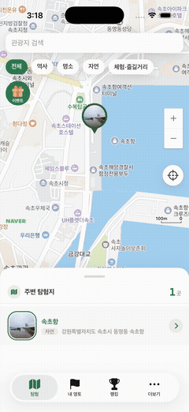
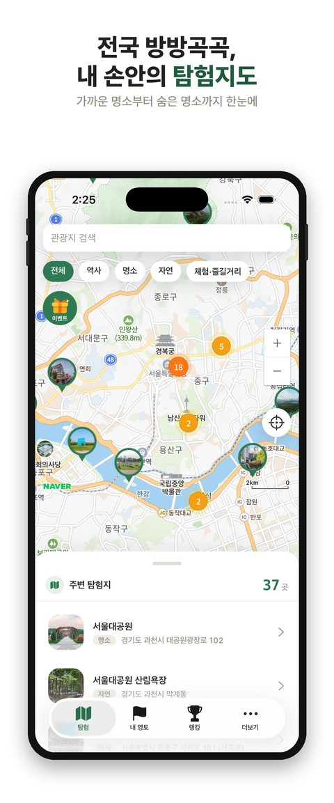

# 온땅 (Onttang)

> **전국의 땅을 모두 내 영지로** — 한국관광공사 TourAPI 기반 **관광지 탐험 + 방문 스탬프 + 전국 랭킹** 풀스택 모바일 앱

관광지를 지도·리스트로 탐험하고, 실제로 방문(GPS 인증)해 스탬프를 모아 나만의 "영토"를 넓혀가는 앱입니다. 기획·디자인·프론트엔드·백엔드·배포까지 1인으로 진행했고, **iOS App Store에 정식 출시**(Google Play는 비공개 테스트 진행 중)되어 있습니다.

**[App Store에서 다운로드](https://apps.apple.com/kr/app/%EC%98%A8%EB%95%85/id6793561247)**

---

<table>
<tr>
<td></td>
<td></td>
<td></td>
<td></td>
</tr>
</table>

## 스크린샷

<table>
<tr>
<td></td>
<td></td>
<td></td>
<td></td>
</tr>
<tr>
<td align="center">지도 탐험</td>
<td align="center">지역·테마 검색</td>
<td align="center">관광지 상세</td>
<td align="center">전국 랭킹</td>
</tr>
</table>

---

## 주요 기능

- **지도 기반 탐험** — 네이버 지도 위에 전국 관광지 마커를 클러스터링해 표시, 바텀시트로 리스트 동시 열람
- **검색 · 필터** — 지역(17개 시·도) × 테마(자연/역사/체험/명소) 조합 검색
- **GPS 방문 스탬프** — 반경 500m 이내 접근 시에만 스탬프 인증 가능(위치 스푸핑 방지)
- **내 영토 대시보드** — 탐험한 곳 수, 지역별 탐험률(%), 테마 커버리지를 시각화
- **전국 랭킹** — 최다 탐험자 배지(Lottie 애니메이션) + 실시간 순위표
- **스탬프 쿠폰 이벤트** — 일정 개수 탐험 시 실물 쿠폰 교환
- **소셜 로그인 3종** — Kakao · Apple · Google (JWT 기반 세션)
- **약관/개인정보처리방침/계정삭제** 웹페이지 자체 호스팅 (스토어 심사 요건 충족)
- **OTA 업데이트** — EAS Update로 JS/카피 변경은 스토어 재심사 없이 즉시 배포

---

## 트러블슈팅 하이라이트

실서비스를 운영하면서 실제로 마주치고 해결한 문제들입니다.

- **CocoaPods 링크 누락으로 인한 프로덕션 렌더링 버그** — `react-native-svg`가 `package.json`엔 있었지만 `ios/Pods`엔 실제로 설치되지 않아, 랭킹 화면의 SVG 배지가 `Unimplemented component` 에러로 깨짐. `pod install` 재실행 + 재빌드로 해결하고, 이후 네이티브 의존성 추가 시 체크리스트화.
- **Android 크래시** — `expo-symbols`의 `SymbolView`가 iOS 전용 SF Symbols 문자열을 그대로 써서 Android에서 크래시. Material Symbols 네이밍(하이픈 없는 스네이크)으로 분기 처리.
- **백그라운드 복귀 시 위치 유실** — 앱이 백그라운드에서 돌아올 때 GPS 워처가 갱신되지 않아 "현재 위치"가 stale해지는 문제를 `AppState` 리스너로 방어.
- **행정구역 통합코드 주소 오표기** — 광주·전남이 관광공사 API에서 통합 지역코드를 쓰는 특이 케이스라 검색 필터에서 동명 지역(광주광역시 vs 경기 광주시)이 섞이는 버그를 별도 매핑으로 수정.
- **고속 이동 시 GPS 리렌더 폭주** — 차량 이동처럼 위치가 빠르게 갱신될 때 나침반·마커가 매 프레임 리렌더되어 프레임 드랍 발생 → 스로틀링으로 완화.
- **구글 플레이 "혼동을 야기하는 주장" 정책 대응** — 관광 정보가 공공데이터임을 명시하고 출처 링크·면책 고지를 앱 내에 추가해 정책 위반 이슈 해결.

---

## 프로젝트 구조

```
onttang/
├─ src/
│  ├─ app/                      # Expo Router 화면 (파일 기반 라우팅)
│  │  ├─ (tabs)/index.tsx       #  탐험: 지도 + 바텀시트 + 검색/카테고리
│  │  ├─ (tabs)/territory.tsx   #  내 영토 대시보드
│  │  ├─ (tabs)/ranking.tsx     #  전국 랭킹
│  │  ├─ (tabs)/more.tsx        #  프로필/설정
│  │  ├─ attraction/[id].tsx    #  관광지 상세
│  │  ├─ search.tsx             #  지역·테마 검색
│  │  ├─ coupon-box.tsx         #  스탬프 쿠폰 이벤트
│  │  └─ login.tsx              #  소셜 로그인
│  ├─ components/               # 마커·리스트 아이템·상세 UI
│  ├─ constants/                # 디자인 토큰(theme)·API URL
│  ├─ hooks/                    # 소셜 로그인 훅 등
│  ├─ lib/                      # api 클라이언트·유틸
│  ├─ stores/                   # zustand (인증·검색·카테고리 필터)
│  └─ types/                    # 타입 정의
├─ server/                      # FastAPI 백엔드 (별도 실행) → server/README.md
│  └─ routers/                  # attractions · auth · coupons · rankings · stamps · me
├─ app.config.ts                # Expo 설정
├─ eas.json                     # EAS Build/Update 프로필
└─ RUNNING.md                   # 앱 실행 가이드(터널·시뮬·실기기)
```

---

## 현재 상태

- **iOS App Store 출시** (v1.0.1) — 지도 탐험, 검색, 관광지 상세, 소셜 로그인, GPS 스탬프, 내 영토, 전국 랭킹, 쿠폰 이벤트, OTA 업데이트 모두 반영
- **Google Play 비공개 테스트 진행 중**
